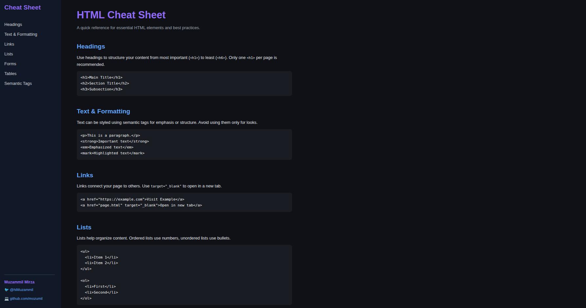

# 📝 HTML Cheat Sheet by Muzammil Mirza


A visually modern, beginner-friendly **HTML Cheat Sheet** built with **HTML** and **CSS** (dark mode included!), featuring a responsive sidebar, structured reference sections, and simple rendered code examples.

---

## 📌 Table of Contents

- [📖 About](#-about)
- [✨ Features](#-features)
- [🖼️ Preview](#-preview)
- [⚡ Getting Started](#-getting-started)
- [🌐 Live Demo](#-live-demo)
- [🙋‍♂️ Author](#-author)
- [📜 License](#-license)

---

## 📖 About

This project is a handy and beautiful reference for essential HTML elements, tags, and best practices. It’s perfect for beginners, students, or anyone who needs a quick refresher on HTML syntax and semantics. The sidebar allows fast navigation between common HTML topics, and the design ensures readability on both desktop and mobile devices.

---

## ✨ Features

- 🗂️ **Sidebar navigation** for quick access to all sections
- 💡 **Real HTML code examples** with live preview (tables, lists, etc.)
- 🌒 **Dark theme** for modern, comfortable reading
- 🧑‍🎓 **Beginner-friendly explanations** for each element
- 🖥️ **Responsive design** for all screen sizes
- ⚡ **Minimal and clean CSS** for customization

---

## 🖼️ Preview




---

## ⚡ Getting Started

1. **Clone this repository:**
    ```bash
    git clone https://github.com/mozumil/html-cheat-sheet.git
    cd html-cheat-sheet
    ```

2. **Open `index.html` in your browser:**
    - No dependencies required!
    - The design is fully static and runs anywhere.

3. **Customize:**
    - Edit `index.html` to add or change topics.
    - Adjust `styles.css` for colors, spacing, and more.

---

## 🌐 Live Demo

🔗 **[View Live Demo](https://mozumil.github.io/html-cheat-sheet/)**

---

## 🙋‍♂️ Author

**Muzammil Mirza**  
🐦 [@hiMuzammil](https://x.com/hiMuzammil)  
💻 [github.com/mozumil](https://github.com/mozumil)  

---

## 📜 License

This project is licensed under the **Apache License 2.0**.  
See [LICENSE](LICENSE) for details.

---